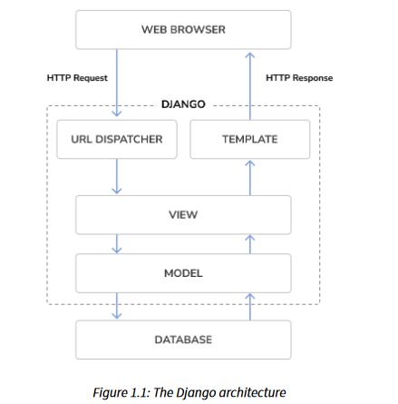
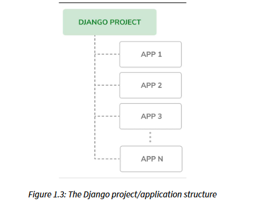
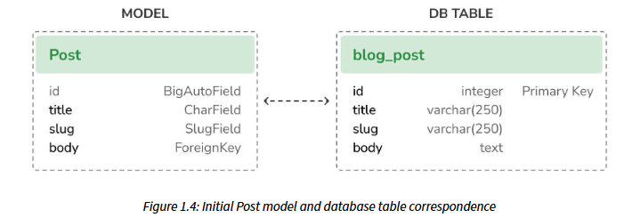
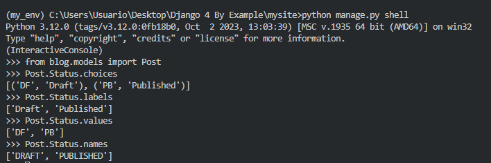
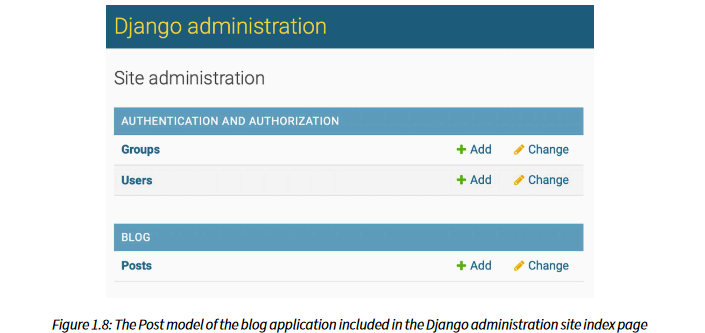
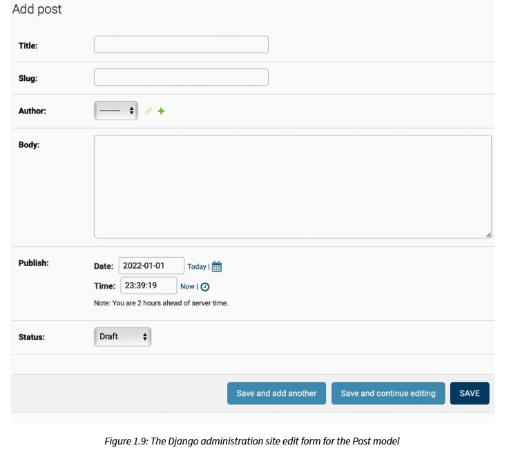
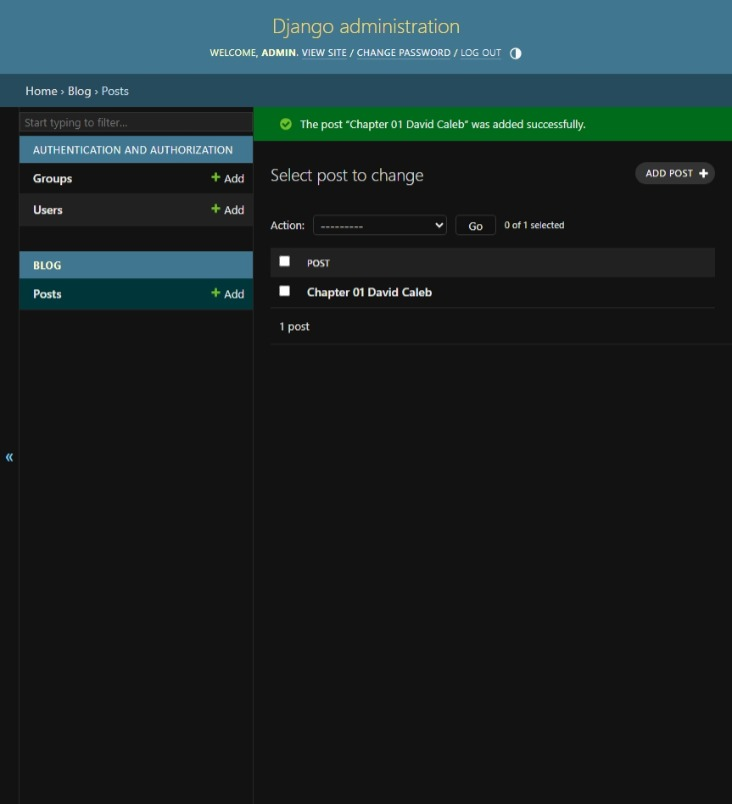

# Chapter 1

Crear un entorno:
``` py
python -m venv my_env
```

Activar el entorno:
``` py
my_env\Scripts\activate
```

Instalar el Django:
``` py
pip install Django
```

Revisar versión Django
``` py
python -m django --version
```

## The Djnago architecture:


This is how Django handles HTTP requests and generates responses:
1. A web browser requests a page by its URL and the web server passes the HTTP request to Django.
2. Django runs through its configured URL patterns and stops at the first one that matches the
requested URL.
3. Django executes the view that corresponds to the matched URL pattern.
4. The view potentially uses data models to retrieve information from the database.
5. Data models provide the data definition and behaviors. They are used to query the database.
6. The view renders a template (usually HTML) to display the data and returns it with an HTTP
response.

## Creating your first project
Comando para crear un proyecto:
``` py
django-admin startproject mysite
```

>*IMPORTANTE*  
> No modificar manage.py \
> asgi.py: Se utiliza para la configuración del proyecto esto se utiliza para Asynchronous Server
Gateway Interface (ASGI). \
> settings.py: Es la configuración del proyecto y contiene los ajustes iniciales.\
> urls.py: Aqui se definen las URLs para mapear en la vista. \
> wsgi.py: Esta es la configuración para correr el proyecto como Web Server Gateway Interface (WSGI)


## Applying initial database migrations
__La configuración por defecto es SQLite3__

Crear las tablas relacionadas:
```
cd mysite
python manage.py migrate
```

## Running the development server:
Empezar el server de desarrollo
``` py
python manage.py runserver
```

Correr el servidor con un host  puerto especifico:
``` py
python manage.py runserver 127.0.0.1:8001 --settings=mysite.settings
```

## Proyect settings
En `setting.py`
* __DEBUG:__ is a Boolean that turns the debug mode of the project on and off. If it is set to True, Django
will display detailed error pages when an uncaught exception is thrown by your application.
When you move to a production environment, remember that you have to set it to False.
Never deploy a site into production with DEBUG turned on because you will expose sensitive
project-related data.
* __ALLOWED_HOSTS:__ is not applied while debug mode is on or when the tests are run. Once you
move your site to production and set DEBUG to False, you will have to add your domain/host
to this setting to allow it to serve your Django site.
* __INSTALLED_APPS:__ is a setting you will have to edit for all projects. This setting tells Django which
applications are active for this site. By default, Django includes the following applications:
  * django.contrib.admin: An administration site
  * django.contrib.auth: An authentication framework.
  * django.contrib.contenttypes: A framework for handling content types
  * django.contrib.sessions: A session framework
  * django.contrib.messages: A messaging framework
  * django.contrib.staticfiles: A framework for managing static files
* __MIDDLEWARE:__ Es una lista que contiene los middleware para ser ejecutados.
* __ROOT_URLCONF:__ Indica el modulo de Python donde la raiz URL de los patrones estan definidos.
* __DATABASES:__ Es un diccionario que contiene las configuraciones de todas las bases de datos que se usan en el proyecto.
* __LANGUAGE_CODE:__ Define el lenguaje por defecto del sitio en Django.
* __USE_TZ:__ Activar o desactivar el soporte de zona horaria. Siempre cuando se crea esta en *TRUE*

## Projects and applications


## Creating an application:
Crear un blog scratch.
``` py
python manage.py startapp blog
```
* `__init__.py`: Un archivo vacío que le indica a Python que trate el directorio del blog como un módulo de Python.
* `admin.py`: Aqui es donde se registra los modelos que incluye la administración de Django 
```
site-using: ES UN SITIO OPCIONAL.
```
* `apps.py`: Es la configuración principal de la app blog.
* `migrations`: Este directorio contiene la base de datos de la app. Sigue una trayectoria del modelo con los cambios y sincroniza la base de datos.
* `models.py`: Incluye la información de modelos de la app. Siempre se necesita tener un **`model.py`**
* `test.py`: Aqui es para probar la app.
* `views.py`: La logica de la aplicación se encuentra en esta parte; Donde recibe peticiones HTTP, procesos y devuelvo una respuesta.

## Creating the Post model
Definimos en primera instancia un modelo **Post**
Se añaden las lineas en `models.py`:
``` py
class Post(models.Model):
    title = models.CharField(max_length=250)
    slug = models.SlugField(max_length=250)
    body = models.TextField()

    def __str__(self):
        return self.title
```
* __title:__ CharField es una columna VARCHAR en SQL.
* __slug:__ SlugField es una columna VARCHAR en SQL que contiene solo letras, numeros, guiones bajos o guiones.
* __body:__ TextField es una columna de TEXT en SQL.


## Adding datetime fields
Continuamos en `models.py` para añadir una fecha y hora especifica de cuando el _Post_ fue creado y cuando fue su ultima modificación.
Se añaden nuevas lineas a `models.py`
```py
from django.db import models
from django.utils import timezone

class Post(models.Model):
    title = models.CharField(max_length=250)
    slug = models.SlugField(max_length=250)
    body = models.TextField()
    publish = models.DateTimeField(default=timezone.now)
    created = models.DateTimeField(auto_now_add=True)
    updated = models.DateTimeField(auto_now=True)

    def __str__(self):
        return self.title
```
* __publish:__ DateTimeField es una columna tipo DATETIME en SQL. Ademas para añadir la zona horaria se utiliza timezone.
* __created:__ DateTimeField es una columna tipo DATETIME en SQL. Ademas se utiliza auto_now_add para crear una fecha automaticamente cuando se crea un objeto.
* __updated:__ DateTimeField es una columna tipo DATETIME en SQL. Ademas se utiliza auto_now para crear una fecha automaticamente cuando se modifica un objeto.

## Defining a default sort order
Cuando se publica un Blog siempre se crea los Post de forma del mas nuevo al mas antiguo.
Editamos `models.py`:
``` py
from django.db import models
from django.utils import timezone

class Post(models.Model):
    title = models.CharField(max_length=250)
    slug = models.SlugField(max_length=250)
    body = models.TextField()
    publish = models.DateTimeField(default=timezone.now)
    created = models.DateTimeField(auto_now_add=True)
    updated = models.DateTimeField(auto_now=True)

    class Meta:
        ordering = ['-publish']

    def __str__(self):
        return self.title
```

Al agregar la clase Meta dentro del modelo, se define la metadata para el modelo.

## Adding a database index
Definiremos una base de datos indexada para el campo __publish__. Esto servira para filtrar el orden de los resultados dado el campo.
Editamos `models.py`:
``` py
from django.db import models
from django.utils import timezone

class Post(models.Model):
    title = models.CharField(max_length=250)
    slug = models.SlugField(max_length=250)
    body = models.TextField()
    publish = models.DateTimeField(default=timezone.now)
    created = models.DateTimeField(auto_now_add=True)
    updated = models.DateTimeField(auto_now=True)

    class Meta:
        ordering = ['-publish']
        indexes = [models.Index(fields=['-publish'])]
        # indexes = [models.Index(fields=ordering)]

    def __str__(self):
        return self.title
```

## Activating the application
Para activar la aplicación del blog, debemos editar el archivo `settings.py` y `blog.apps.BlogConfig` en __INSTALLED_APPS__
``` py
INSTALLED_APPS = [
    'django.contrib.admin',
    'django.contrib.auth',
    'django.contrib.contenttypes',
    'django.contrib.sessions',
    'django.contrib.messages',
    'django.contrib.staticfiles',
    'blog.apps.BlogConfig'
]
```

## Adding a status field
Una función en un blog es guardar en un borrador hasta que la publicación este terminada.
Editamos `models.py`:
``` py
from django.db import models
from django.utils import timezone

class Post(models.Model):
    
    class Status(models.TextChoices):
        DRAFT = 'DF', 'Draft'
        PUBLISHED = 'PB', 'Published'
    
    title = models.CharField(max_length=250)
    slug = models.SlugField(max_length=250)
    body = models.TextField()
    publish = models.DateTimeField(default=timezone.now)
    created = models.DateTimeField(auto_now_add=True)
    updated = models.DateTimeField(auto_now=True)
    status = models.CharField(max_length=2,
                              choices=Status.choices,
                              default=Status.DRAFT)

    class Meta:
        ordering = ['-publish']
        indexes = [models.Index(fields=['-publish'])]
        # indexes = [models.Index(fields=ordering)]

    def __str__(self):
        return self.title
```
Al definir la Clase _Status_ en una subclase para los estados de borrador[DRAFT] y publicado[PUBLISHED].
* Al utilizar __Post.Status.choices__ se obtiene las opciones disponibles.
* Al utilizar __Post.Status.labels__ se obtiene los nombres legibles.
* Al utilizar __Post.Status.values__ se obtienen los valores de las opciones.
* CharField, es un parametro para limitar el valor del campo a las opciones de Status.choices, ademas de añadir un valor por defecto que en este caso es borrador[DRAFT].



## Adding a many-to-one relationship
Los Post siempre estan relacionados por un autor. Para crear una relación entre los usuarios y Post. Django tiene un modulo para generar una autenticación para crear la relación entre usuarios y post.
Se edita `models.py`:
``` py
from django.db import models
from django.utils import timezone
from django.contrib.auth.models import User

class Post(models.Model):
    
    class Status(models.TextChoices):
        DRAFT = 'DF', 'Draft'
        PUBLISHED = 'PB', 'Published'
    
    title = models.CharField(max_length=250)
    slug = models.SlugField(max_length=250)
    author = models.ForeignKey(User, 
                               on_delete=models.CASCADE,
                               related_name='blog_post')
    body = models.TextField()
    publish = models.DateTimeField(default=timezone.now)
    created = models.DateTimeField(auto_now_add=True)
    updated = models.DateTimeField(auto_now=True)
    status = models.CharField(max_length=2,
                              choices=Status.choices,
                              default=Status.DRAFT)

    class Meta:
        ordering = ['-publish']
        indexes = [models.Index(fields=['-publish'])]
        # indexes = [models.Index(fields=ordering)]

    def __str__(self):
        return self.title
```
* Al importar el __User__ del modelo _django.contrib.auth.models_ y añadir un campo de __author__ para el modelo de Post, esto sirve para la relación de muchos a uno.
* __on_delete:__ Este parametro se utiliza especificamente para adoptar cuando la referencia del objeto es borrada. Al utilizar __CASCADE__ se puede especificar la referencia usuario es borrado y se borran todos los blogs posteados.
* __related_name:__ Es un nombre especifico para la relación del __User__ para el __Post__.

## Creating and applying migrations
Ahora se necesita crear tabla de una abse de datos.
`migrate` aplica migración para todas las aplicaciones listadas en __INSTALLED_APPS__.

Se utiliza el siguiente comando para la raiz del archivo:
```py
python manage.py makemigrations blog
```
Al ejecutar ese comando se genera un archivo `blog/migrations/0001_initial.py`

En este archivo se genera un contenido de migración, qque especifica la dependencia en otras migraciones y operaciones en la base de datos para sincronizar con el modelo.

Al ejecutar el siguiente comando este nos genera un codigo en SQL que ejecutara para crear una tabla para el modelo.
```py
python manage.py sqlmigrate blog 0001
```

Django crea una columna usando la PK para cada modelo pero se puede modificar con `primary_key = True` en uno de los campos de los modelos.

Dadas las tres bases de datos index se crearon:
* Un index con orden descendente en la columna __publish__. Esto fue el index que se definio en la clase __Meta__.
* Un index en la columna __slug__ porque __SlugField__ implica que un index por defecto.
* Un index en la columna __author_id__ porque el campo __ForeignKey__ es un index por defecto.


Se ejecuta:
```py 
python manage.py migrate
```

## Creating an administration site for models
Django por defecto incluye una interfaz de adminitración.

## Creating a superuser
Para crear un superuser se debe correr el siguiente comando:
```py
python manage.py createsuperuser
```
Y me dirigo a 
http://127.0.0.1:8000/admin/

Se llena la información:
* usuario
* email
* password
* password(again)

## The Django administration site
Para iniciar el servidor utilizamos:
``` py
python manage.py runserver
```

Se utiliza la cuenta que se creo
>[!IMPORTANT]\
>username: admin

Los modelos del __Group__ y __User__ se pueden ve en:
``` py
django.contrib.auth
```

## Adding models to the administartion site
Se edita el archivo `admin.py` y se añade lo siguiente:

```py
from django.contrib import admin
from .models import Post

admin.site.register(Post)
```
Al ingresar nuevamente queda así:






## Customizing how models are displayed
Se edita `admin.py`:
```py
from django.contrib import admin
from .models import Post

admin.site.register(Post)

@admin.register(Post)
class PostAdmin(admin.ModelAdmin):
    list_display = ['title', 'slug', 'author', 'publish', 'status']
```

Se registra en la administración de Django el modelo custom, que esta heredando de `ModelAdmin`.

En `list_display` estamos añadiendo mas campos en el modelo para la lista de administración.
El `@admin.register()` tiene la misma función que `admin.site.register()` función que puede ser remplazada, se añade algunos decoradores. En el archivo `admin.py`:

```py
from django.contrib import admin
from .models import Post

admin.site.register(Post)
admin.site.unregister(Post) #SIN ESTO SACA UN ERROR OJO

@admin.register(Post)
class PostAdmin(admin.ModelAdmin):
    list_display = ['title', 'slug', 'author', 'publish', 'status']
    list_filter = ['status', 'created', 'publish', 'author']
    search_fields = ['title', 'body']
    prepopulated_fields = {'slug': ('title',)}
    raw_id_fields = ['author']
    date_hierarchy = 'publish'
    ordering = ['status', 'publish']
```

## Working with QuerySets and managers
Django tiene una database bastante robusta [object-relational mapper (ORM)] para la abstracción de API donde se puede crear, recuperar, actualizar y eliminar objetos fácilmente. 

El ORM mapea los modelos a tablas de bases de datos y se tienen que configurar en `settings.py` Django puede trabajar con multiples bases de datos al tiempo.

Django ORM esta basado en QuerySets, que son colecciones de base de datos para recuperar objetos de tu base de datos. Se pueden aplicar los filtros de QuerySets dando unos parametros.

## Creating objets
Ejecutar en cmd:
``` py
python manage.py shell
```

``` py
from django.contrib.auth.models import User
from blog.models import Post
user = User.objects.get(username='admin')
post = Post(title='Another post',
    slug = 'another-post',
    body='Post body.', 
    author=user)
post.save()
```

* __user:__ Con el metodo get esta devolviendo un solo objeto de la base de datos, si no existe dentro de la base de datos arroja `DoesNotExist` y si devuelve mas de un resultado arroja `MultipleObjectsReturned`.
* Al momento de crearse la instancia Post con esos parametros estos objetos se crean en memoria y no se guardan en la base de datos.
* Al crear el objeto en memoria se puede utilizar la operación `create()`

``` py
Post.objets.create(title='One more post',
    slug = 'one-more-post',
    body='Post body.', 
    author=user)
```

## Updating objets
Para `UPDATE` utilizamos:
```py
post.title = 'New title'
post.save
```

## Retrieving objets
Para recuperar todos los objetos de una tabla se usa el metodo `all()`:
```py
all_posts = Post.objets.all()
```
Genera una QuerySet que devuelve todos los objetos en la base de datos.

Al momento de ejecutar solo:
```py
Post.objects.all() 
<QuerySet [<Post: New title>, <Post: Chapter 01 David Caleb>]>
```

## Using the filter() method
Para recuperar todos los que se hayan publicado en una fecha se puede utilizar:
```py
Post.objects.filter(publish__year=2023)
```

Se puede crear multiples campos de filtros:
```py
Post.objects.filter(publish__year=2023, author__username='admin')
```
o
```py
Post.objects.filter(publish__year=2023).filter(author__username='admin')
```

## Using exclude()
Se puede excluir las busquedas utilizando el metodo`exclude()`
```py
Post.objects.filter(publish__year=2023).exclude(title__startswith='Chapter')
```

## Using order_by()
Se puede ordernar por diferentes campos usando el metodo `order_by()`:
* En este caso devuelve todos en orden dado su titulo:
    ```py
    Post.objects.order_by('title')
    ```
* En orden ascendente, se tiene que añadir el `-`
    ```py
    Post.objects.order_by('-title')
    ```

## Deleting objets
Para eliminar un objeto, se puede utilizar el metodo `delete()`:
```py
post = Post.objects.get(id=1)
post.delete()
```
> [!NOTE]
> 
> la eliminación de objetos también eliminará cualquier relación dependiente para objetos ForeignKey definidos
con on_delete en CASCADE.

## When QuerySets are evaluated
QuerySets are only evaluated in the following cases:
Los QuerySets sólo se evalúan en los siguientes casos:
* La primera vez que se itera sobre ellos
* Cuando los rebanas, por ejemplo, `Post.objects.all()[:3]`
* Cuando los almacena en caché
* Cuando se llama a `repr()` o `len()` sobre ellos.
* Cuando se les llama explícitamente `list()`
* Cuando los prueba en una sentencia, como `bool()`, `or`, `and`, or `if`

## Creating model managers
Por defecto los managers para cada modelo es un `objects`. Todos los objetos se recuperen de la base de datos, pero se pueden definir managers para los modelos.

Se puede realizar de dos formas:
Añadir un metodo manager a uno ya existente o crearlo para modificarlo al iniciar `QuerySet`.

* Uno trata de proporcionar una notación QuerySet como `Post.objects.my_manager()`
* El otro consiste en proporcionar una notación QuerySet como `Post.my_manager.all()`

Editamos `models.py`

```py
from django.db import models
from django.utils import timezone
from django.contrib.auth.models import User

class PublishedManager(models.Manager):
    def get_queryset(self):
        return super().get_queryset()\
            .filter(status=Post.Status.PUBLISHED)

class Post(models.Model):
    
    class Status(models.TextChoices):
        DRAFT = 'DF', 'Draft'
        PUBLISHED = 'PB', 'Published'
    
    title = models.CharField(max_length=250)
    slug = models.SlugField(max_length=250)
    author = models.ForeignKey(User, 
                               on_delete=models.CASCADE,
                               related_name='blog_post')
    body = models.TextField()
    publish = models.DateTimeField(default=timezone.now)
    created = models.DateTimeField(auto_now_add=True)
    updated = models.DateTimeField(auto_now=True)
    status = models.CharField(max_length=2,
                              choices=Status.choices,
                              default=Status.DRAFT)
    

    objects = models.Manager() # manager por defecto
    published = PublishedManager() # El custom manager

    class Meta:
        ordering = ['-publish']
        indexes = [
            models.Index(fields=['-publish']),
            ]
        #indexes = [models.Index(fields=ordering)]

    def __str__(self):
        return self.title
```

* El primer manager en un modelo se convierte en el gestor por defecto. Se puede utilizar el atributo de la clase `Meta` para especificar otro gestor por defecto se utiliza `    default_manager_name`. Si no se utiliza se crea uno por defecto. Hay que declarar los manager para los modelos, pero si hay que mantener el gestor manager toca añadirlos.

* El metodo `get_queryset()`    devuelve el manager que se va a ejecutar. (En este caso se creo uno personalizado que se filtra dado su estado y solo las devuelve cuando esta en [PUBLISHED])


Para revisar todas las publicaciones que empiezan con 'Chapter' utilizamos:
``` py
from blog.models import Post
Post.published.filter(title__startswith='Who')
<QuerySet []>
```

## Building list and detail views
Para construir una vista de la app, en Python es una función que recibe un request y devuelve una web.
Se crea una app de vista donde se definen unos parametros de URLS para la vista, y finalmente creamos un template para generar los datos.

## Creating list and details view
Edit  `views.py`:
``` py
from django.shortcuts import render
from .models import Post

def post_list(request):
    posts = Post.published.all()
    return render(request, 
                'blog/post/list.html',
                {'posts': posts})
```
* __post_list:__ La vista toma las requets en un solo parametro.
* En esta vista se esta solicitando todas las vistas que se encuentren en el estado [PUBLISHED]
* al utilizar la función `render()` tiene el contexto de la petición.

Se crea otra vista que despliega un solo post. Editamos `views.py`:
```py
from django.shortcuts import render
from .models import Post
from django.http import Http404

def post_list(request):
    posts = Post.published.all()
    return render(request, 
                'blog/post/list.html',
                {'posts': posts})

def post_detail(request, id):
    try:
        post = Post.published.get(id=id)
    except Post.DoesNotExist:
        raise Http404("No Post found")
    
    return render(request,
                'blog/post/detail.html',
                {'post':post})
```
Esta view, se intenta recuperar el Post con el id dado llamando al metodo `get()`
del gestor de objetos por defecto, se utiliza una excepción HTTP404 para devolver un error y una excepción por si no existe.`render()`
Se utiliza para renderizar la entrada publicada usando una plantilla.


## Using the get_object_or_404 shortcut
En Django existe una forma de llamar a `get()`
en un gestor de modelos y lanzar una excepción HTTP404
Edit `views.py`:
```py
from django.shortcuts import render, get_object_or_404
from .models import Post

def post_list(request):
    posts = Post.published.all()
    return render(request, 
                'blog/post/list.html',
                {'posts': posts})

def post_detail(request, id):
    post = get_object_or_404(Post,
                             id=id,
                             status=Post.Status.PUBLISHED)

    return render(request,
                'blog/post/detail.html',
                {'post':post})
```
Al utilizar `get_object_or_404()` Esta función se utiliza para recuperar el objeto que coincida con los parametros dados o una excepción HTTP404 si no se encuentran ningun objeto.

## Adding URL patterns for your views
Las URL esta compuesta por un parametro, una vista y opcionalmente un nombre que nombra la URL en todo el proyecto. Django recorre los patrones y se detiene en el que coicida con la URL solicitada.

Creamos un archivo `urls.py` en `blog`

```py
from django.urls import path
from . import views

app_name = 'blog'

urlpatterns = [
    path('',views.post_list, name='post_list'),
    path('<int:id>/', views.post_detail, name='post_detail'),
]
```
* __app_name:__ se utiliza para organizar las URL por app y utilizar el nombre cuando se hace referencia a ellas.
Se usan dos patrones utilizando la función `path()`.
* Uno no tiene argumentos y se le asigna `post_list`.
* El otro se asigna a la view `post_detail` y solo tiene el argumento de id, que convierte el int en parte del path.
* Se utiliza `<>` para capturar los valores de la URL. cualquier valor como String se convierte en parte del path como `<int:year>`, que devuelve un numero entero. Si se utiliza `<slug:post>` coicidira especificamente con un slug. (Estas cadenas pueden contener letras, numeros, guiones bajos o guiones).

Ahora se edita la `urls.py` en `mysite`:
```py
from django.contrib import admin
from django.urls import path, include

urlpatterns = [
    path('admin/', admin.site.urls),
    path('blog/', include('blog.urls',namespace='blog')),
]
```

* La nueva URL se define con `include` que se refiere a la URL que se definio en blog.
* Los `namespaces` deben de ser unicos en todo el proyecto.
por ejemplo, `blog:post_list` y
`blog:post_detail`.

## Creating templates for your views
Al crear las views y las URLS para la aplicación. Los patrones asignan a las vistas y las vistas devuelven los datos al usuario. Estas plantillas como se muestran los datos. Estas suelen ser en HTML.

Se crean unos directorios y archivos en la raiz del proyecto:
```
templates/
    blog/
        base.html
        post/
            list.html
            detail.html
```
* __base.html:__ este archivo incluira la estructura html principal y divide el contenido en el area de contenido principal y una barra lateral.
* Los archivos __list.html__ y __detail.html__ heredan del archivo __base.html__ para mostrar las vistas de lista y detalle de las entradas del blog, respectivamente.
* - Las etiquetas de plantilla controlan la representación de la plantilla y se parecen a ``.
- Las variables de plantilla se reemplazan con valores cuando la plantilla se muestra y se ven como `{{
variable }}`
- Los filtros de plantilla permiten modificar las variables para su visualización y tienen el aspecto `{{ variable|filter }}`.


## Creating a base template
Editamos `base.html`:
```html

<!DOCTYPE html>
<html lang="en">
<head>
    <meta charset="UTF-8">
    <meta name="viewport" content="width=device-width, initial-scale=1.0">
    <title></title>
    <link rel="stylesheet" href="">
</head>
<body>
    <div id="content">
        
        
    </div>
    <div id="sidebar">
        <h2>My blog</h2>
        <p>This is my blog</p>
    </div>
</body>
</html>
```
* __:__ Carga las etiquetas proporcionadas por Django.
* __:__ Con esta etiqueta puede incluir archivos estaticos, como el archivo `blog.css`.
* __:__ Estas etiquetas indican la definición de un block y los templates que hereden pueden rellenar los bloques con contenido.

Se crea la ruta para `blog.css` y se crea el archivo.
`mysite\blog\static\css\blog.css`.

```css
body { 
    margin:0;
    padding:0;
    font-family:helvetica, sans-serif; 
}

a { 
    color:#00abff;
    text-decoration:none; 
}

h1 { 
    font-weight:normal;
    border-bottom:1px solid #bbb;
    padding:0 0 10px 0;
}

h2 {
    font-weight:normal;
    margin:30px 0 0;
}

#content { 
    float:left;
    width:60%;
    padding:0 0 0 30px; 
}

#sidebar { 
    float:right;
    width:30%;
    padding:10px;
    background:#efefef; 
    height:100%;
}

p.date { 
    color:#ccc;
    font-family: georgia, serif;
    font-size: 12px;
    font-style: italic; 
}

/* pagination */
.pagination { 
    margin:40px 0; 
    font-weight:bold;
}

/* forms */
label { 
    float:left;
    clear:both;
    color:#333;
    margin-bottom:4px; 
}
input, textarea { 
    clear:both;
    float:left;
    margin:0 0 10px;
    background:#ededed;
    border:0;
    padding:6px 10px;
    font-size:12px;
}
input[type=submit] {
    font-weight:bold;
    background:#00abff;
    color:#fff;
    padding:10px 20px;
    font-size:14px;
    text-transform:uppercase; 
}
.errorlist { 
    color:#cc0033;
    float:left;
    clear:both;
    padding-left:10px; 
}

/* comments */
.comment {
    padding:10px;
}
.comment:nth-child(even) {
    background:#efefef;
}
.comment .info {
    font-weight:bold;
    font-size:12px;
    color:#666;
}
```

## Creating the post list template
Editar `post/list.html`
```html


My Blog


<h1>My Blog</h1>

<h2>
    <a href="">
        {{ post.title }}
    </a>
</h2>
<p class="date">
    Published {{ post.publish  }} by {{ post.author }} 
</p>
{{ post.body | truncatewords:30|linebreaks}}



```

* __:__ Se utiliza para heredar la plantilla de `blog/base.html`
* Rellena los blocks con los title y contenidos.
* Recorre las entradas y muestra el titulo, fecha, autor y el cuerpo con un enlace en el titulo a la URL.
* __:__ Construye la etiqueta de plantilla, tambien se crean dinamicamente por su nombre
* __blog:post_detail:__ Se utiliza para referirnos a la URL post_detail en el espacio de nombres blog.

Pasamos el parámetro post.id necesario para construir la URL para cada post.

* Siempre se utiliza el template de ____ para construir URLs para que sean mas faciles de mantener.
* Se aplica dos filtros de plantilla: truncatewords trunca el valor al número de palabras especificado y linebreaks convierte la salida en saltos de línea HTML. De palabras especificado, y linebreaks convierte la salida en saltos de línea HTML. Puede concatenar tantos
filtros de plantilla que desee; cada uno se aplicará a la salida generada por el anterior.

# PREGUNTAR JAIRO ERRORES
- 'DIRS': [BASE_DIR, 'blog','templates'] EN SETTINGS, sin eso saca error, pero no queda el css.
- Tal ves sea debido a que cree mal las rutas:
```
templates/
    blog/
        base.html
        post/
            list.html
            detail.html
```